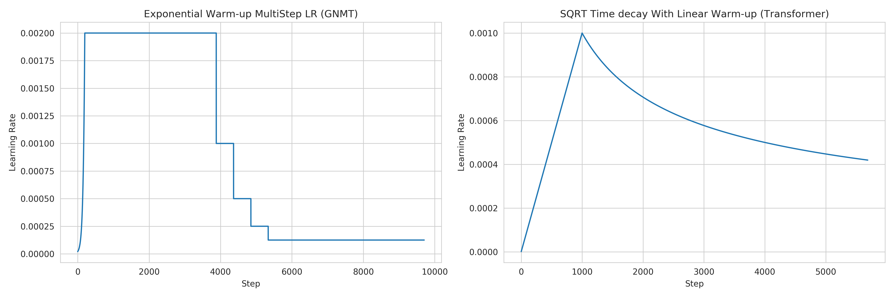
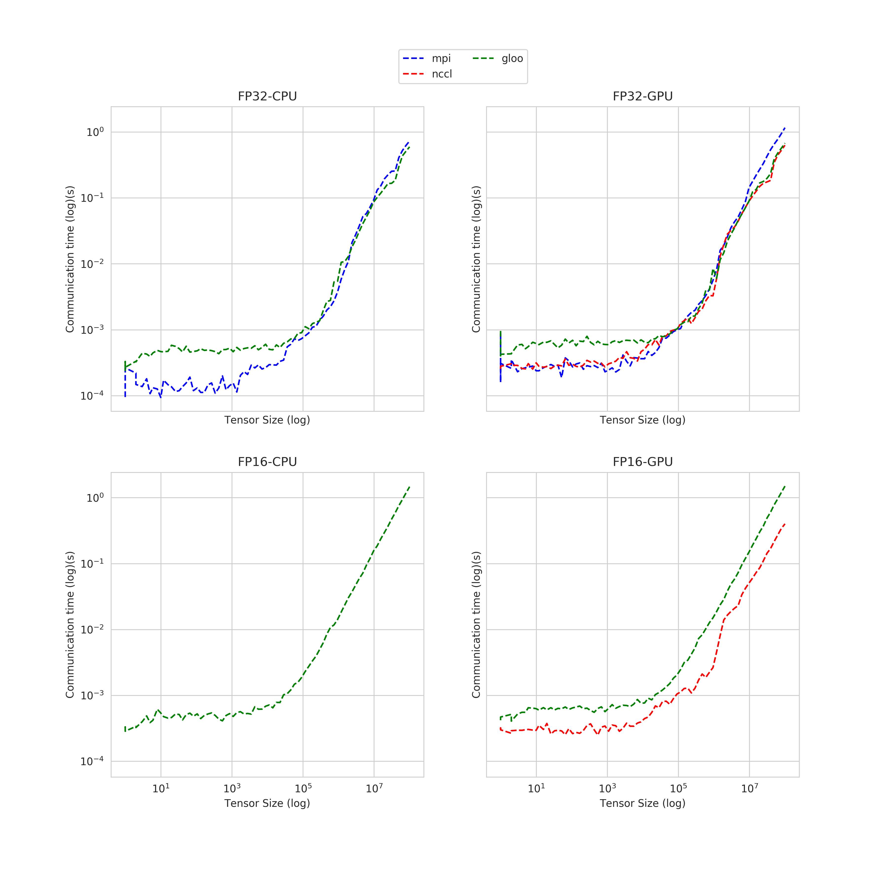

.. _benchmark-tasks:

Benchmark Tasks
===============

The results can be found here: benchmark-task-results_

Benchmark Metrics
-----------------

The basic metric for comparison is `Time to Accuracy`, i.e. training time of the system until a specified target accuracy is reached (where accuracy will be test and/or training accuracy).

The variable dimensions are:

- Algorithm
  - limited number of prescribed standard algorithms, according to strict reference implementations provided
- Hardware
  - GPU(s)
  - CPU(s)
  - Memory
- Scalability
  - Number of workers
- Network
  - Impact of bandwidth and latency

Benchmark Task Descriptions
---------------------------
We here provide precise descriptions of the official benchmark tasks. The task are selected to be representative of relevant machine learning workloads in both industry and in the academic community. The main goal here is a fair, reproducible and
precise comparison of most state-of-the-art algorithms, frameworks, and hardware.

For each task, we provide a reference implementation, as well as results for different systems.

Task 0: Communication Backend Raw Performance
^^^^^^^^^^^^^^^^^^^^^^^^^^^^^^^^^^^^^^^^^^^^^

This task consists of benchmarking the communication backends for different frameworks and operations.

.. _benchmark-task-0a:

0.a All-reduce
""""""""""""""

In this task, tensors of increasing size in ``np.logspace(0, 8, num=80)`` are sent between workers, 100 times for each tensor size.
This allows for measuring and comparing the communication times for each backend for an `all-reduce` operation.

Task 1: Image Classification
^^^^^^^^^^^^^^^^^^^^^^^^^^^^
.. _benchmark-task-1a:

1a. Resnet-20, CIFAR-10
"""""""""""""""""""""""

Image classification is one of the most important problems in computer vision and a classic example of supervised machine learning.

#. **Model**
    We benchmark two model architectures of Deep Residual Networks (ResNets)
    based on prior work by He et al.
    The first model (m1) is based on the ResNets defined in :cite:`DBLP:journals/corr/HeZRS15`.
    The second version (m2) is based on the ResNets defined in :cite:`DBLP:journals/corr/HeZR016`.
    For this benchmark implementation, we use 20 layers ResNet called ResNet-20 using the first version stated previously.

#. **Dataset**
    The `CIFAR-10 <https://www.cs.toronto.edu/~kriz/cifar.html>`_
    dataset containing a set of images used to train machine learning
    and computer vision models.
    It contains 60,000 32x32 color images in 10 different classes,
    with 6000 images per class. The 10 different classes represent
    airplanes, cars, birds, cats, deer, dogs, frogs, horses, ships, and trucks.

    The train / test split as provided in the dataset is used.
    The test dataset contains 10,000 images with exactly 1000 randomly-selected images per each class.
    The rest 50,000 images are training samples.

#. **Training Algorithm**
    We use standard synchronous SGD :cite:`DBLP:journals/corr/0002AMVSKKD16` as the optimizer (distributed mini-batch SGD with synchronous all-reduce communication before each mini-batch update).

    - number of machines ``k = 1, 2, 4, 8, 16, 32``
    - minibatch size per worker ``b = 128``
    - maximum epochs: 164
    - learning rate

      + learning rate :math:`\eta` : 0.02
      + decay: We reduce the learning rate when a plateau in the validation loss is reached for 2 consecutive epochs
      + scaling and warmup: apply ``linear scaling rule`` mentioned in :cite:`goyal2017accurate`. The learning rate is scaled from
        :math:`\eta` to :math:`\eta \times k` within the first :math:`log_{2}(num\_workers)`.

    - optimizer: ``CentralizedSGD(momentum=0.9, nesterov=True, weight_decay=1e-4, dampening=0, by_layer=False)``
    - loss : ``CrossEntropyLoss``

    Besides, in each round workers access disjoint set of datapoints.

Implementation details:

#. **Data Preprocessing**
    We followed the same approach described in :cite:`DBLP:journals/corr/HeZRS15`.

#. **Selection of Framework & Systems**
    We aim to provide the same algorithm in multiple frameworks, primarily focusing on PyTorch and Tensorflow.
    For the systems, kubernetes allows easy transferability of our code.
    While initial results reported are from google kubernetes engine, AWS will be supported very soon.

#. **Environments for Scaling Task**
    We use a single process per node environment, with one GPU per process (i.e. one GPU per node).
    The bandwidth between two nodes is around 7.5Gbit/s. ``MPI``, ``GLOO`` or ``NCCL`` are used for communication.

.. _benchmark-task-1b:

1b. Resnet-?, ImageNet
""""""""""""""""""""""

TODO

Task 2: Linear Learning
^^^^^^^^^^^^^^^^^^^^^^^
.. _benchmark-task-2a:

2.a Logistic Regression, Epsilon 2008
"""""""""""""""""""""""""""""""""""""

#. **Model**
    We benchmark Logistic Regression with L2 regularization.

#. **Dataset**
    The `epsilon <https://www.csie.ntu.edu.tw/~cjlin/libsvmtools/datasets/binary.html>`_ dataset
    is an artificial and dense dataset which is used for Pascal large scale learning challenge
    in `2008 <http://www.k4all.org/project/large-scale-learning-challenge/>`_.
    It contains 400,000 training samples and 100,000 test samples with 2000 features.

#. **Training Algorithm**
    We use standard synchronous SGD :cite:`DBLP:journals/corr/0002AMVSKKD16` as the optimizer (that is distributed mini-batch SGD with synchronous all-reduce communication before each mini-batch).

    - number of machines ``k = 1, 2, 4, 8, 16``
    - minibatch size per worker ``b = 128``
    - maximum epochs: 164
    - learning rate

      + learning rate :math:`\eta` : 4
      + decay: We reduce the learning rate when a plateau in the validation loss is reached for 2 consecutive epochs
      + scaling: The learning rate is scaled from :math:`\eta` to :math:`\eta \times k` for :math:`k` workers

    - optimizer: ``CentralizedSGD(momentum=0, nesterov=False, weight_decay=0, dampening=0, by_layer=False)``
    - loss: ``BCELossRegularized`` (Binary Cross-Entropy Loss with regularization)
    - regularization parameters: :math:`L1=0, L2 = 0.0000025`

**Implementation details:**

#. **Data Preprocessing**
    Dataset is pre-processed prior to training, and stored on [here](https://storage.googleapis.com/mlbench-datasets/libsvm).
    The pre-processing script can be found under `mlbench_core/dataset/util/pytorch/libsvm.py`, and generates `.lmdb`
    files from the original dataset. One can easily generate the used dataset by running:

    .. code-block:: bash

        $ python mlbench_core/dataset/util/pytorch/libsvm.py epsilon [test | train] [dest_dir]

#. **Selection of Framework & Systems**
    We aim to provide the same algorithm in multiple frameworks, primarily focusing on PyTorch and Tensorflow.
    For the systems, kubernetes allows easy transferability of our code.
    While initial results reported are from google kubernetes engine, AWS will be supported very soon.

#. **Environments for Scaling Task**
    We use a single process per node environment, with no GPU acceleration.
    The bandwidth between two nodes is around 7.5Gbit/s. ``MPI`` or ``GLOO`` are used for communication.

Task 3: Language Modelling
^^^^^^^^^^^^^^^^^^^^^^^^^^

.. _benchmark-task-3a:

3a. TODO
""""""""

Task 4: Machine Translation
^^^^^^^^^^^^^^^^^^^^^^^^^^^

.. _benchmark-task-4a:

4.a LSTM, WMT16 EN-DE
"""""""""""""""""""""

#. **Model**
    We benchmark the GNMT Machine Translation Model :cite:`DBLP:journals/corr/WuSCLNMKCGMKSJL16`, which follows the sequence-to-sequence learning framework,
    and uses stacked residual LSTM connections in the encoder and decoder modules. The residual connections allow
    for deeper stacked LSTM layers, as without residuals, the stack typically suffer from
    vanishing/exploding gradients when too many layers are used.

#. **Dataset**
    The `WMT-16 <http://www.statmt.org/wmt16/metrics-task/>`_
    dataset containing a set of translated sentences from multiple languages.
    We exclusively use English-German translation from this dataset.

#. **Training Algorithm**
    We use Synchronous distributed Adam as the optimizer, which is similar to :cite:`DBLP:journals/corr/0002AMVSKKD16`,
    but uses Adam's update rule:
    Before each weight update, gradients on all workers are summed using an ``all_reduce`` operation;
    that way, all workers share their gradients and obtain the same weight update.
    However, since the data is quite large, weight updates don't happen for all batches. Instead, the gradients are aggregated
    for a certain number of batches. For example, when using 2 workers, we update every 8 batches (for 4 workers, it would be 4 batches).
    We call this parameter `update frequency`.

    Also, this training algorithm uses mixed precision training (explained below).

    - number of machines ``k = 1, 2, 4, 8, 16, 32``
    - minibatch size per worker ``b = 128`` sentences
    - update frequency ``update_freq = max(16 // num_workers, 1)``
    - maximum epochs: 8
    - learning rate (Figure 1. left plot)

      + ``initial_learning_rate = 0.0``
      + ``base_learning_rate = 2.0e-3``, linearly increased to 4.0e-3 for 64 workers
      + decay: We decay by :math:`0.5` after having gone through 40% of total training, and then for every 5% for maximum 4 times
      + scaling and warmup: We use 20 warmup steps, where the learning rate is exponentially increased from
        ``initial_learning_rate`` to ``base_learning_rate``

    - optimizer: ``Adam(betas=(0.9, 0.999), eps=1e-8, weight_decay=0, amsgrad=False)``
    - loss: ``LabelSmoothingLoss`` (Negative Log-Likelihood with smoothing)
    - gradient clipping: max norm of 5.0
    - Loss Scaling

      + ``initial_scale = 2**10``
      + ``scale_factor = 2`` (downscale and upscale)
      + ``max_scale = 2**13``
      + ``scale_window = 128`` (steps after upscale if no overflow/underflow)

Implementation details:

#. **Data Preprocessing**
    The data needs to be downloaded and pre-processed and tokenized using the pre-processing script
    `mlbench_core/dataset/nlp/pytorch/wmt16/preprocess/preprocess.py` before training.
    The pre-processed data is available on our `S3 <https://storage.googleapis.com/mlbench-datasets/translation/wmt16_en_de.tar.gz>`_

#. **Mixed Precision Training**
    In order to have faster backward and forward passes, our model's weights and gradients are cast into ``float16`` prior to training.
    ``float32`` weights are still kept in memory and used by the optimizer to update weights. We use our own ``FP16Optimizer``.
    Since ``float16`` has lower precision than ``float32``, it is necessary to have a loss scaler:

        - Start with ``loss_scale = initial_scale``
        - Before each backward pass, inflate the loss by ``loss_scale`` (in ``float16``) to avoid under-flows
        - Before weight update, deflate gradients by ``loss_scale`` (in ``float32``) to keep precision
        - Clip gradient norm to be ``grad_clip``
        - Check if gradient norm is ``nan`` or ``inf`` (in ``float16``). If True, ``loss_scale = loss_scale / scale_factor``.
          If False, update weights.
        - If after ``scale_window`` updates, no overflow/underflow detected, ``loss_scale = loss_scale * scale_factor``

#. **Selection of Framework & Systems**
    We currently only have this reference implementation in PyTorch. For the systems, kubernetes allows easy transferability of our code.
    While initial results reported are from Google Kubernetes engine, AWS will be supported very soon.

#. **Environments for Scaling Task**
    We use a single process per node environment, with one GPU per process (i.e. one GPU per node).
    The bandwidth between two nodes is around 7.5Gbit/s. ``MPI`` or ``NCCL`` are used for communication.

    Figure 1: Learning rate scheduler for GNMT and Transformer

.. _benchmark-task-4b:

4.b Transformer, WMT17 EN-DE
""""""""""""""""""""""""""""

#. **Model**
    We benchmark the Transformer Model, using attention mechanisms based on the paper
    "Attention Is All You need" :cite:`DBLP:journals/corr/VaswaniSPUJGKP17` that. The implementation is based on
    a combination of NVIDIA's implementation of `fairseq <https://github.com/pytorch/fairseq>`_ 's transformer.
    Our implementation differs from MLPerf's in one subtle way: the `FusedLayerNorm` layers are changed to native
    torch `LayerNorm`, as its performance has increased since. Also, instead of using `FusedAdam`, we use `Adam`.
    One part of the `MultiheadAttention` module needs a cuda extension, that makes training significantly faster than
    torch's native `MultiheadAttention`

#. **Dataset**
    The `WMT-17 <http://www.statmt.org/wmt17/>`_
    dataset containing a set of translated sentences from multiple languages.
    We exclusively use English-German translation from this dataset.

#. **Training Algorithm**
    We use Synchronous distributed Adam as the optimizer, which is similar to :cite:`DBLP:journals/corr/0002AMVSKKD16`,
    but uses Adam's update rule:
    Before each weight update, gradients on all workers are summed using an ``all_reduce`` operation and divided by ``world_size * update_frequency``;
    that way, all workers share their gradients and obtain the same weight update.
    However, since the data is quite large, weight updates don't happen for all batches. Instead, the gradients are aggregated
    for a certain number of batches. For example, when using 2 workers, we update every 8 batches (for 4 workers, it would be 4 batches).
    We call this parameter `update frequency`.

    Also, this training algorithm uses mixed precision training (explained below).

    - number of machines ``k = 1, 2, 4, 8, 16, 32``
    - max number of tokens per mini-batch ``b = 8192`` (1 to 16 workers), ``4096`` (32 workers), ``2048`` (64 workers)
    - update frequency ``update_freq = max(16 // num_workers, 1)``
    - maximum epochs: 10
    - learning rate (Figure 1. right plot)

      + ``initial_learning_rate = 0.0``
      + ``base_learning_rate = 1.976e-3``
      + decay: We decay by :math:`\sqrt{N}` after warmup
      + scaling and warmup: We use 1000 warmup steps, where the learning rate is linearly increased from
        ``initial_learning_rate`` to ``base_learning_rate``

    - optimizer: ``Adam(betas=(0.9, 0.98), eps=1e-9, weight_decay=0, amsgrad=False)``
    - loss: ``LabelSmoothingLoss`` (Negative Log-Likelihood with smoothing)
    - Loss Scaling

      + ``initial_scale = 2**7``
      + ``scale_factor = 2`` (downscale and upscale)
      + ``scale_window = 2000`` (steps after upscale if no overflow/underflow)

Implementation details:

#. **Data Preprocessing**
    The data needs to be downloaded and pre-processed and tokenized using the pre-processing script
    `mlbench_core/dataset/nlp/pytorch/wmt17/preprocess/preprocess.py` before training.
    The pre-processed data is available on our `S3 storage <https://storage.googleapis.com/mlbench-datasets/translation/wmt17_en_de.tar.gz>`_

#. **Mixed Precision Training**
    In order to have faster backward and forward passes, our model's weights and gradients are cast into ``float16`` prior to training.
    ``float32`` weights are still kept in memory and used by the optimizer to update weights. We use our own `FP16Optimizer`.
    Since ``float16`` has lower precision than ``float32``, it is necessary to have a loss scaler:

        - Start with ``loss_scale = initial_scale``
        - Before each backward pass, inflate the loss by ``loss_scaling`` (in ``float16``) to avoid under-flows
        - Before weight update, deflate gradients by ``loss_scaling * full_batch_size / (world_size * update_freq)`` (in ``float32``) to keep precision, where ``full_batch_size`` is the batch size over all workers (sum of number of tokens on this batch for each worker).
        - Check if gradient norm is ``nan`` or ``inf`` (in ``float16``). If True, ``loss_scale = loss_scale / scale_factor``.
          If False, update weights.
        - If after ``scale_window`` updates, no overflow/underflow detected, ``loss_scale = loss_scale * scale_factor``

#. **Selection of Framework & Systems**
    We currently only have this reference implementation in PyTorch. For the systems, kubernetes allows easy transferability of our code.
    While initial results reported are from google kubernetes engine, AWS will be supported very soon.

#. **Environments for Scaling Task**
    We use a single process per node environment, with one GPU per process (i.e. one GPU per node).
    The bandwidth between two nodes is around 7.5Gbit/s. ``MPI`` or ``NCCL`` are used for communication.

.. _benchmark-task-results:

Benchmark Results
-----------------

Here we present the results for scaling tasks. All results were generated on the Google Cloud Kubernetes Engine.

Task 0: Communication Backend
^^^^^^^^^^^^^^^^^^^^^^^^^^^^^
0.a PyTorch All-reduce
""""""""""""""""""""""

#. **Frameworks**
    PyTorch

#. **System Hardware**
    - machine type: `n1-standard-4 <https://cloud.google.com/compute/pricing>`_ instances on GCP with 15GB memory and 4 virtual CPUs.
    - available CPUs: 3 CPUs available for pod (1 for Kubernetes management)
    - GPU: `NVIDIA® Tesla® T4` (16GB GDDR6, Turing arch)

#. **Pricing**
    - `n1-standard-4`: $0.2092/hour (regular), $0.0440/hour (preemptible)
    - `NVIDIA® Tesla® T4`: $0.35/hour (regular), $0.11/hour (preemptible)

    Figure 2: Communication times for 2 workers

* Figure 2 shows the communication times between 2 workers for each backend, for tensors of type ``float32`` and ``float16``, both on CPU and GPU.
* This graph allows for a quantitative comparison of the different backends, and to study their advantages/disadvantages.
* We can see that MPI behaves well for small ``float32`` tensors, with similar performance as NCCL.
* NCCL works better than MPI for larger tensors, and has the advantage of supporting ``float16``, while MPI doesn't.
* GLOO has poor performance compared to others, but has the main advantage to be the only backend supporting ``float16`` training on CPU.

Task 1: Image Classification
^^^^^^^^^^^^^^^^^^^^^^^^^^^^

1a. Resnet-20, CIFAR-10
"""""""""""""""""""""""

#. **Frameworks**
    PyTorch and Tensorflow

#. **System Hardware**
    - machine type: `n1-standard-4 <https://cloud.google.com/compute/pricing>`_ instances on GCP with 15GB memory and 4 virtual CPUs.
    - available CPUs: 3 CPUs available for pod (1 for Kubernetes management)
    - GPU: `NVIDIA® Tesla® T4` (16GB GDDR6, Turing arch)

#. **Metric**
    Time to Accuracy of 80% on validation set.

#. **Pricing**
    - `n1-standard-4`: $0.2092/hour (regular), $0.0440/hour (preemptible)
    - `NVIDIA® Tesla® T4`: $0.35/hour (regular), $0.11/hour (preemptible)

* The next figure shows the speedup in training times to 80% accuracy relative to training on one node [3]_. The baseline time for 1 worker for the PyTorch CPU implementation is
  5895 s, for the PyTorch GPU implementation 407 s and for the Tensorflow GPU implementation 1191 s.

.. image:: images/task1a_speedup.png
    :scale: 48
    :align: center

* This figure shows the time spent in compute and communication for the PyTorch GPU implementation on 1, 2, 4, 8 and 16 workers.

.. image:: images/scaling-comm-compute-gpu.png
    :scale: 26
    :align: center

* The next figure compares the cost of experiment. Note that a regular `n1-standard-4` instance costs $0.19 per hour and
  a preemptible one costs only $0.04. `NVIDIA® Tesla® K80` GPUs (preemtpible) cost $0.135 per hour. All costs shown are for premtible instances.

.. image:: images/task1a_pricing.png
    :scale: 48
    :align: center

.. [3] Training on CPU shows speedup with increasing number of nodes up to 32 nodes.
       For the Pytorch implementation on the GPU, speedups plateau at 4 nodes and decrease for 32 nodes. Tensorflow GPU numbers are only available up to 8 nodes, as more nodes
       lead to an Out-Of-Memory error on the GPU. This benchmark is still a work in progress and this issue will be fixed in a future release. Also since Tensorflow requires at least one
       parameter-server and a worker to run, it can't be run on a single machine. As such, the results between PyTorch and Tensorflow are not directly comparable. Tuning the Tensorflow
       parameter-server in size when growing the number of total machines might require further tuning

1b. Resnet-?, ImageNet
""""""""""""""""""""""
TODO

Task 2: Linear Learning
^^^^^^^^^^^^^^^^^^^^^^^

2.a Logistic Regression, Epsilon 2008
"""""""""""""""""""""""""""""""""""""

#. **Frameworks**
    PyTorch

#. **System Hardware**
    - machine type: `n1-standard-4 <https://cloud.google.com/compute/pricing>`_ instances on GCP with 15GB memory and 4 virtual CPUs.
    - available CPUs: 3 CPUs available for pod (1 for Kubernetes management)

#. **Metric**
    Time to Accuracy of 80% on validation set.

#. **Pricing**
    - `n1-standard-4`: $0.2092/hour (regular), $0.0440/hour (preemptible)

* First figure shows the speedup of time to accuracy, for test accuracy of 89%, as the size of the cluster increases.
  Even though initially the speedup grows with the number of nodes added to the cluster,
  the benefit starts dropping for a cluster bigger than 16 nodes. This is mostly due to the issue of
  large-batch training. As the local batch-size of each worker is fixed, the global batch-size increases
  with the number of workers. Hence, while increasing batch size up to a point makes the training faster,
  beyond a certain point it will no longer reduce the number of training steps required, making it slower
  to reach the same accuracy.

* Second figure illustrates how the loss value drops over time for various number of nodes.
  The black dotted line shows the target loss value, which is 0.2828 for this particular dataset.

* Last figure shows the average communication-computation time ratio for a node in the cluster.
  As we expected, the more workers we have, the more time is spent in communication.

|pic5| |pic6|

|pic7|

.. |pic5| image:: images/SGD_time_to_accuracy.png
    :scale: 48

.. |pic6| image:: images/SGD_loss_time.png
    :scale: 48

.. |pic7| image:: images/communication_time_ratio.png
    :scale: 48

Task 3: Language Modelling
^^^^^^^^^^^^^^^^^^^^^^^^^^

3a. TODO
""""""""

Task 4: Machine Translation
^^^^^^^^^^^^^^^^^^^^^^^^^^^

4.a LSTM, WMT16 EN-DE
"""""""""""""""""""""

#. **Frameworks**
    PyTorch

#. **System Hardware**
    - machine type: `n1-standard-4 <https://cloud.google.com/compute/pricing>`_ instances on GCP with 15GB memory and 4 virtual CPUs.
    - available CPUs: 3 CPUs available for pod (1 for Kubernetes management)
    - GPU: `NVIDIA® Tesla® T4` (16GB GDDR6, Turing arch)

#. **Metric**
    Time to BLEU-Score of 24.0 on test set.

#. **Pricing**
    - `n1-standard-4`: $0.2092/hour (regular), $0.0440/hour (preemptible)
    - `NVIDIA® Tesla® T4`: $0.35/hour (regular), $0.11/hour (preemptible)

4.b Transformer, WMT17 EN-DE
""""""""""""""""""""""""""""

#. **Frameworks**
    PyTorch

#. **System Hardware**
    - machine type: `n1-standard-4 <https://cloud.google.com/compute/pricing>`_ instances on GCP with 15GB memory and 4 virtual CPUs.
    - available CPUs: 3 CPUs available for pod (1 for Kubernetes management)
    - GPU: `NVIDIA® Tesla® T4` (16GB GDDR6, Turing arch)

#. **Metric**
    Time to BLEU-Score of 25.0 on test set.

#. **Pricing**
    - `n1-standard-4`: $0.2092/hour (regular), $0.0440/hour (preemptible)
    - `NVIDIA® Tesla® T4`: $0.35/hour (regular), $0.11/hour (preemptible)

Benchmark Task Implementations
------------------------------

For details on the available Benchmark implementations, please see :ref:`Benchmark Implementations <mlbench-benchmarks:benchmark-implementations>` .

.. rubric:: References

.. bibliography:: benchmark-tasks.bib
   :cited:

