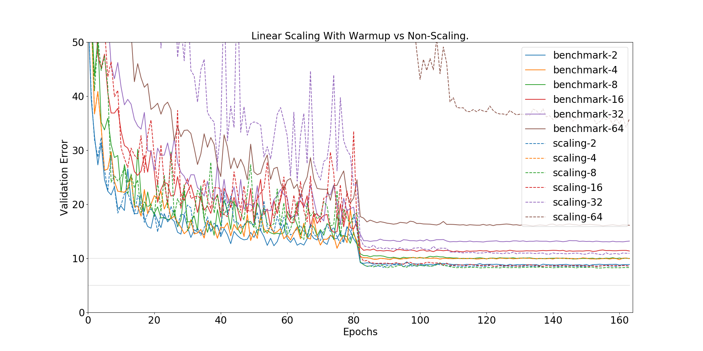
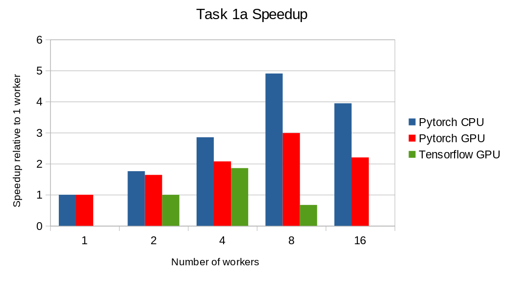
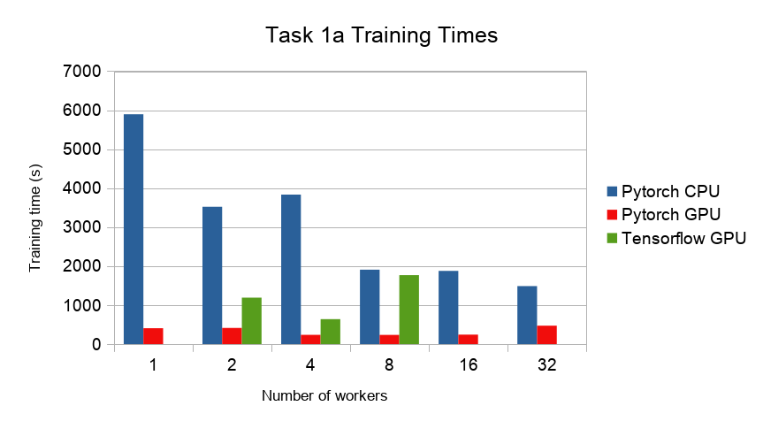
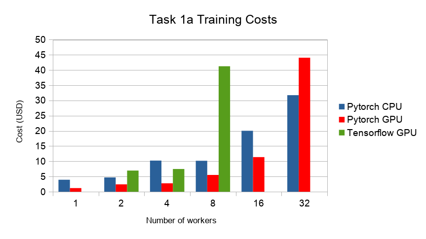
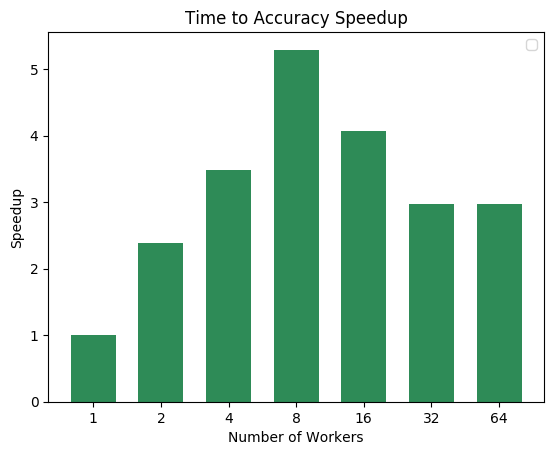
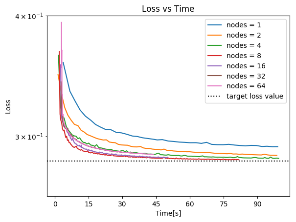
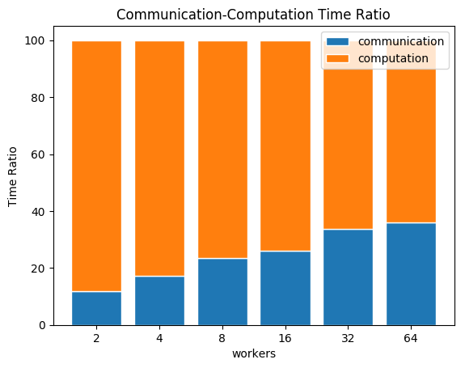

.. _benchmark-tasks:

==================
Benchmarking Tasks
==================

Benchmark Divisions
-------------------

There are two divisions of benchmarking, the closed one which is restrictive to allow fair comparisons of specific training algorithms and systems,
and the open divisions, which allows users to run their own models and code while still providing a reasonably fair comparison.

Closed Division
~~~~~~~~~~~~~~~

The Closed Division encompasses several subcategories to compare different dimensions of distributed machine learning. We provide precise reference implementations of each algorithm, including the communication patterns, such that they can be implemented strictly comparable between different hardware and software frameworks.

The two basic metrics for comparison are `Accuracy after Time` and `Time to Accuracy` (where accuracy will be test and/or training accuracy)

Variable dimensions in this category include:

- Algorithm
  - limited number of prescribed standard algorithms, according to strict reference implementations provided
- Hardware
  - GPU
  - CPU(s)
  - Memory
- Scalability
  - Number of workers
- Network
  - Impact of bandwidth and latency

Accuracy after Time
###################

The system has a certain amount ot time for training (2 hours) and at the end, the accuracy of the final model is evaluated.
The higher the better

Time to Accuracy
################
A certain accuracy, e.g. 97% is defined for a task and the training time of the system until that accuracy is reached is measured.
The shorter the better.

.. _Deep Residual Learning for Image Recognition:
    https://www.cv-foundation.org/openaccess/content_cvpr_2016/papers/He_Deep_Residual_Learning_CVPR_2016_paper.pdf

Here is a plot of validation error training iterations for ResNet on `CIFAR-10 <http://www.cs.toronto.edu/~kriz/cifar.html>`__ using the settings from `Deep Residual Learning for Image Recognition`_.

.. image:: images/km2016deep.png
    :align: center

Open Division
~~~~~~~~~~~~~
The Open Division allows you to implement your own algorithms and training tricks and compare them to other implementations. There's little limit to what can be changed by you and as such, it is up to you to make sure that comparisons are fair.

In this division, mlbench merely provides a platform to easily perform and measure distributed machine learning experiments in a standardized way.

Benchmark Task Descriptions
---------------------------
We here provide precise descriptions of the official benchmark tasks. The task are selected to be representative of relevant machine learning workloads in both industry and in the academic community. The main goal here is a fair, reproducible and
precise comparison of most state-of-the-art algorithms, frameworks, and hardware.

For each task, we provide a reference implementation, as well as benchmark metrics and results for different systems.

1a. Image Classification (ResNet, CIFAR-10)
~~~~~~~~~~~~~~~~~~~~~~~~~~~~~~~~~~~~~~~~~~~
Image classification is one of the most important problems in computer vision and a classic example of supervised machine learning.

#. **Model**
    We benchmark two model architectures of Deep Residual Networks (ResNets)
    based on prior work by He et al.
    The first model (m1) is based on the ResNets defined in
    `this paper <https://arxiv.org/abs/1512.03385>`_.
    The second version (m2) is based on the ResNets defined `here
    <https://arxiv.org/abs/1603.05027>`_.
    For each version we have the network implementations
    with 20, 32, 44, and 56 layers.

    TODO: only benchmark two most common architectures say (can support more, but they are not part of the official benchmark task)

#. **Dataset**
    The `CIFAR-10 <https://www.cs.toronto.edu/~kriz/cifar.html>`_
    dataset containing a set of images used to train machine learning
    and computer vision models.
    It contains 60,000 32x32 color images in 10 different classes,
    with 6000 images per class. The 10 different classes represent
    airplanes, cars, birds, cats, deer, dogs, frogs, horses, ships, and trucks.

    The train / test split as provided in the dataset is used.
    The test dataset contains 10,000 imagest with exactly 1000 randomly-selected images per each class.
    The rest 50,000 images are training samples.

#. **Training Algorithm**
    We use standard synchronous SGD as the optimizer (that is distributed mini-batch SGD with synchronous all-reduce communication after each mini-batch).

    - number of machines :math:`k`: 2, 4, 8, 16, 32
    - minibatch size per worker :math:`b`: 32
    - maximum epochs: 164
    - learning rate

      + learning rate per sample :math:`\eta` : 0.1 / 256
      + decay: similar to `Deep Residual Learning for Image Recognition`_, we reduce learning rate by 1/10 at the 82-th and 109-th epoch.
      + scaling and warmup: apply ``linear scaling rule`` mentioned in :cite:`goyal2017accurate`. The learning rate per worker is scaled from
        :math:`\eta \times b` to :math:`\eta \times b \times k` within the first 5 epochs.

    - momentum: 0.9
    - nesterov: True
    - weight decay: 0.0001

    Besides, in each round workers access disjoint set of datapoints.

Implementation details:

#. **Data Preprocessing**
    We followed the same approach as mentioned `here <https://arxiv.org/abs/1512.03385>`__.

#. **Selection of Framework & Systems**
    We aim to provide the same algorithm in multiple frameworks, primarily focussing on PyTorch and Tensorflow. For the systems, kubernetes allows easy transferability of our code. While initial results reported are from google kubernetes engine, AWS will be supported very soon.

#. **Environments for Scaling Task**
    For the scaling task, we use `n1-standard-4 <https://cloud.google.com/compute/pricing>`_ type instances with 50GB disk size.
    There is only one worker per node; each worker uses 2.5 cpus. The bandwidth between two nodes is around 7.5Gbit/s.
    Openmpi is used for communication. No accelerators are used for this task.

1b. Image Classification (ResNet, ImageNet)
~~~~~~~~~~~~~~~~~~~~~~~~~~~~~~~~~~~~~~~~~~~
TODO
(again synchr SGD as main baseline)

2a. Linear Learning (Logistic Regression, epsilon)
~~~~~~~~~~~~~~~~~~~~~~~~~~~~~~~~~~~~~~~~~~~~~~~~~~

#. **Model**
    We benchmark Logistic Regression with L2 regularization.
#. **Dataset**
    The `epsilon <https://www.csie.ntu.edu.tw/~cjlin/libsvmtools/datasets/binary.html>`_ dataset
    is an artificial and dense dataset which is used for Pascal large scale learning challenge
    in `2008 <http://www.k4all.org/project/large-scale-learning-challenge/>`_.
    It contains 400,000 training samples and 100,000 test samples with 2000 features.

#. **Training Algorithm**
    We use standard synchronous SGD as the optimizer (that is distributed mini-batch SGD with synchronous all-reduce communication after each mini-batch).

    - minibatch size per worker :math:`b`: 100  [1]_
    - learning rate : :math:`\frac{\alpha}{\sqrt{t}}`  [2]_
        Here are the values of alpha we choose for various number of workers:

        ==========     ===============
        nodes          :math:`\alpha`
        ==========     ===============
            1                 200
            2                 400
            4                 600
            8                 700
        16, 32, 64        800
        ==========     ===============
    - momentum: 0
    - weight decay: 0
    - regularization rate :math:`= 0.0000025`

.. [1]  Here is how we select this value:
        We train the model with different batch sizes ([1,..,1000]) and in the end we select the batch size
        that enables the trained model to reach to 89% accuracy on the validation set in less time. we use
        80% of the dataset to train the model, and the remaining 20% is used as the validation set.
.. [2] :math:`\alpha` is tuned for each cluster size separately. To do so, we use 80% of the dataset to train
        the model, and the remaining 20% is used as the validation set. We do a grid search to find the best
        value for alpha: for each value in the grid ([0.001,..,1000]), the model is trained until it reaches
        to 89% accuracy on the validation set. Finally, we select the value that enables the model to reach
        the target accuracy value faster.

**Implementation details:**

#. **Selection of Framework & Systems**
    While our initial reference implementation is currently PyTorch, we will aim to provide the same algorithm in more frameworks very soon, starting with Tensorflow. For the systems, kubernetes allows easy transferability of our code. While initial results reported are from google kubernetes engine, AWS will be supported very soon.

#. **Environments for Scaling Task**
    For the scaling task, we use `n1-standard-4 <https://cloud.google.com/compute/pricing>`_ type instances with 50GB disk size.
    There is only one worker per node; each worker uses 2.5 cpus. The bandwidth between two nodes is around 7.5Gbit/s.
    Openmpi is used for communication. No accelerators are used for this task.

Benchmark Task Results
----------------------

1a. Image Classification (ResNet, CIFAR-10)
~~~~~~~~~~~~~~~~~~~~~~~~~~~~~~~~~~~~~~~~~~~

Here we present the results for scaling task. All results were generated on the Google Cliud Kubernetes Engine. `n1-standard-4` instances were used for training,
with `NVIDIA® Tesla® K80` GPUs used for GPU training.

 The first figure is the validation error rate for linear scaling scheduler and benchmark with different cluster size. For 2, 4, 8, 16 nodes, scaling the size of cluster gives same accuracy within same number of epochs. The global batch size is 2048 when the number of nodes is 16. For 32 or more nodes, the validation error is higher but is still decreasing; they need more epochs to converge considering there are less iterations. For all cases except 64 nodes, using linear scaling scheduler gives higher accuracy and better convergence speed.

* The next figure compares the actual throughput and expected throughput. Since all of the nodes use same hardwares, the perfect throughput is linearly dependent on the number of nodes. The actual throughput is marginally below than the perfect scaling due to the communication cost.

.. image:: images/scaling-throughput.png
    :scale: 48
    :align: center

* The next figure shows the speedup in training times relative to training on one node. Training on CPU shows speedsup with increasing number of nodes up to 32 nodes.
  For the Pytorch implementation on the GPU, speedups plateau at 4 nodes and decrease for 32 nodes. Tensorflow GPU numbers are only available up to 8 nodes, as more nodes
  lead to an Out-Of-Memory error on the GPU. This could indicate a technical limitation in the Tensorflow benchmark.

* The next figure hand side figure compares the time to 80% accuracy for different number of nodes. Times on the GPU are up to a factor of 10 faster than the respective
  CPU implementation.

* The next figure compares the cost of experiment. Note that a regular `n1-standard-4` instance costs $0.19 per hour and
  a preemptible one costs only $0.04. `NVIDIA® Tesla® K80` GPUs (preemtpible) cost $0.135 per hour. All costs shown are for premtible instances.

1b. Image Classification (ResNet, ImageNet)
~~~~~~~~~~~~~~~~~~~~~~~~~~~~~~~~~~~~~~~~~~~
TODO

2a. Linear Learning (Logistic Regression, epsilon)
~~~~~~~~~~~~~~~~~~~~~~~~~~~~~~~~~~~~~~~~~~~~~~~~~~

Here we present the results for the scaling task.

* First figure shows the speedup of time to accuracy, for test accuracy of 89%, as the size of the cluster increases.
  Even though initially the speedup grows with the number of nodes added to the cluster,
  the benefit starts dropping for a cluster bigger than 16 nodes. This is mostly due to the issue of
  large-batch training. As the local batch-size of each worker is fixed, the global batch-size increases
  with the number of workers. Hence, while increasing batch size up to a point makes the training faster,
  beyond a certain point it will no longer reduce the number of training steps required, making it slower
  to reach the same accuracy.

* Second figure illustrates how the loss value drops over time for various number of nodes. 
  The black dotted line shows the target loss value, which is 0.2828 for this particular dataset.

* Last figure shows the average communication-computation time ratio for a node in the cluster. 
  As we expected, the more workers we have, the more time is spent in communication.

|pic5| |pic6|

|pic7|

Benchmark Task Implementations
------------------------------

For details on the available Benchmark implementations, please see :ref:`Benchmarking Implementations <mlbench-benchmarks:benchmark-implementations>` .

.. rubric:: References

.. bibliography:: benchmark-tasks.bib
   :cited:

