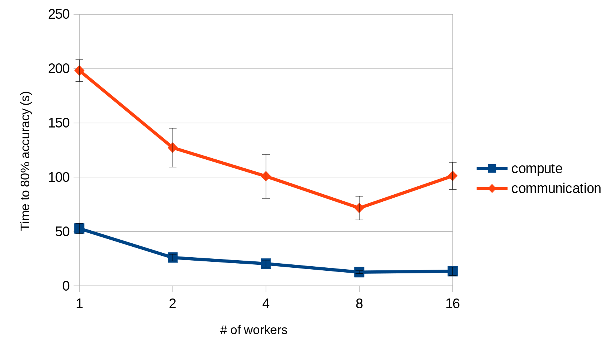

.. _benchmark-tasks:

===============
Benchmark Tasks
===============

The results can be found here: benchmark-task-results_

Benchmark Metrics
-----------------

The basic metric for comparison is `Time to Accuracy`, i.e. training time of the system until a specified target accuracy is reached (where accuracy will be test and/or training accuracy).

The variable dimensions are:

- Algorithm
  - limited number of prescribed standard algorithms, according to strict reference implementations provided
- Hardware
  - GPU(s)
  - CPU(s)
  - Memory
- Scalability
  - Number of workers
- Network
  - Impact of bandwidth and latency

Benchmark Task Descriptions
---------------------------
We here provide precise descriptions of the official benchmark tasks. The task are selected to be representative of relevant machine learning workloads in both industry and in the academic community. The main goal here is a fair, reproducible and
precise comparison of most state-of-the-art algorithms, frameworks, and hardware.

For each task, we provide a reference implementation, as well as results for different systems.

1 Image Classification Tasks
~~~~~~~~~~~~~~~~~~~~~~~~~~~~~

1a. Image Classification (ResNet, CIFAR-10)
###########################################

Image classification is one of the most important problems in computer vision and a classic example of supervised machine learning.

#. **Model**
    We benchmark two model architectures of Deep Residual Networks (ResNets)
    based on prior work by He et al.
    The first model (m1) is based on the ResNets defined in
    `this paper <https://arxiv.org/abs/1512.03385>`_.
    The second version (m2) is based on the ResNets defined `here
    <https://arxiv.org/abs/1603.05027>`_.
    For each version we have the network implementations
    with 20, 32, 44, and 56 layers.

    TODO: only benchmark two most common architectures say (can support more, but they are not part of the official benchmark task)

#. **Dataset**
    The `CIFAR-10 <https://www.cs.toronto.edu/~kriz/cifar.html>`_
    dataset containing a set of images used to train machine learning
    and computer vision models.
    It contains 60,000 32x32 color images in 10 different classes,
    with 6000 images per class. The 10 different classes represent
    airplanes, cars, birds, cats, deer, dogs, frogs, horses, ships, and trucks.

    The train / test split as provided in the dataset is used.
    The test dataset contains 10,000 imagest with exactly 1000 randomly-selected images per each class.
    The rest 50,000 images are training samples.

#. **Training Algorithm**
    We use standard synchronous SGD as the optimizer (that is distributed mini-batch SGD with synchronous all-reduce communication before each mini-batch).

    - number of machines :math:`k`: 2, 4, 8, 16, 32
    - minibatch size per worker :math:`b`: 128
    - maximum epochs: 164
    - learning rate

      + learning rate per sample :math:`\eta` : 0.1 / 256
      + decay: similar to `Deep Residual Learning for Image Recognition`_, we reduce learning rate by 1/10 at the 82-th and 109-th epoch.
      + scaling and warmup: apply ``linear scaling rule`` mentioned in :cite:`goyal2017accurate`. The learning rate per worker is scaled from
        :math:`\eta \times b` to :math:`\eta \times b \times k` within the first 5 epochs.

    - optimizer: CentralizedSGD(momentum=0.9, nesterov=True, weight_decay=1e-4, dampening=0, by_layer=False)

    Besides, in each round workers access disjoint set of datapoints.

Implementation details:

#. **Data Preprocessing**
    We followed the same approach as mentioned `here <https://arxiv.org/abs/1512.03385>`__.

#. **Selection of Framework & Systems**
    We aim to provide the same algorithm in multiple frameworks, primarily focussing on PyTorch and Tensorflow. For the systems, kubernetes allows easy transferability of our code. While initial results reported are from google kubernetes engine, AWS will be supported very soon.

#. **Environments for Scaling Task**
    For the scaling task, we use `n1-standard-4 <https://cloud.google.com/compute/pricing>`_ type instances with 50GB disk size.
    There is only one worker per node; each worker uses 2.5 cpus. The bandwidth between two nodes is around 7.5Gbit/s.
    Openmpi is used for communication. No accelerators are used for this task.

1b. Image Classification (ResNet, ImageNet)
###########################################
TODO

2 Linear Learning
~~~~~~~~~~~~~~~~~

2a. Linear Learning (Logistic Regression, epsilon)
##################################################

#. **Model**
    We benchmark Logistic Regression with L2 regularization.
#. **Dataset**
    The `epsilon <https://www.csie.ntu.edu.tw/~cjlin/libsvmtools/datasets/binary.html>`_ dataset
    is an artificial and dense dataset which is used for Pascal large scale learning challenge
    in `2008 <http://www.k4all.org/project/large-scale-learning-challenge/>`_.
    It contains 400,000 training samples and 100,000 test samples with 2000 features.

#. **Training Algorithm**
    We use standard synchronous SGD as the optimizer (that is distributed mini-batch SGD with synchronous all-reduce communication before each mini-batch).

    - minibatch size per worker :math:`b`: 100  [1]_
    - learning rate : :math:`\frac{\alpha}{\sqrt{t}}`  [2]_
        Here are the values of alpha we choose for various number of workers:

        ==========     ===============
        nodes          :math:`\alpha`
        ==========     ===============
            1                 200
            2                 400
            4                 600
            8                 700
        16, 32, 64        800
        ==========     ===============

    - optimizer: CentralizedSGD(momentum=0, nesterov=False, weight_decay=0, dampening=0, by_layer=False)
    - regularization rate: :math:`L1=0, L2 = 0.0000025`

.. [1]  Here is how we select this value:
        We train the model with different batch sizes ([1,..,1000]) and in the end we select the batch size
        that enables the trained model to reach to 89% accuracy on the validation set in less time. we use
        80% of the dataset to train the model, and the remaining 20% is used as the validation set.
.. [2] :math:`\alpha` is tuned for each cluster size separately. To do so, we use 80% of the dataset to train
        the model, and the remaining 20% is used as the validation set. We do a grid search to find the best
        value for alpha: for each value in the grid ([0.001,..,1000]), the model is trained until it reaches
        to 89% accuracy on the validation set. Finally, we select the value that enables the model to reach
        the target accuracy value faster.

**Implementation details:**

#. **Selection of Framework & Systems**
    While our initial reference implementation is currently PyTorch, we will aim to provide the same algorithm in more frameworks very soon, starting with Tensorflow. For the systems, kubernetes allows easy transferability of our code. While initial results reported are from google kubernetes engine, AWS will be supported very soon.

#. **Environments for Scaling Task**
    For the scaling task, we use `n1-standard-4 <https://cloud.google.com/compute/pricing>`_ type instances with 50GB disk size.
    There is only one worker per node; each worker uses 2.5 cpus. The bandwidth between two nodes is around 7.5Gbit/s.
    Openmpi is used for communication. No accelerators are used for this task.

3 Natural Language Processing
~~~~~~~~~~~~~~~~~~~~~~~~~~~~~

3a. Language Modeling
#####################
(TODO)

3b. Translation EN-DE (LSTM, WMT14)
###################################
(TODO)

3c. Translation EN-DE (Transformer, WMT17)
##########################################

#. **Model**
    We benchmark the Transformer Model, using attention mechanisms based on the paper
    `Attention Is All You need <https://arxiv.org/abs/1706.03762>`_ that. The implementation is based on
    a combination of NVIDIA's implementation of `fairseq <https://github.com/pytorch/fairseq>`_ 's transformer.
    Our implementation differs from MLPerf's in one subtle way: the `FusedLayerNorm` layers are changed to native
    torch `LayerNorm`, as its performance has increased since. Also, instead of using `FusedAdam`, we use `Adam`.
    One part of the `MultiheadAttention` module needs a cuda extension, that makes training significantly faster than
    torch's native `MultiheadAttention`

#. **Dataset**
    The `WMT-17 <http://www.statmt.org/wmt17/>`_
    dataset containing a set of translated sentences from multiple languages.
    We exclusively use English-German translation from this dataset.

#. **Training Algorithm**
    We use Distributed Adam as the optimizer. Before each weight update, gradients on all workers are average using an `all_reduce` operation.
    That way, all workers have the same gradients and hence the same weight updates.
    However, since the data is quite large, weight updates don't happen for all batches. Instead, the gradients are aggregated
    for a certain number of batches. For example, when using 2 workers, we update every 8 batches (for 4 workers, it would be 4 batches).
    We call this parameter `update frequency`.

    Also, this training algorithm uses mixed precision training (explained below).

    - number of machines :math:`k`: 2, 4, 8, 16, 32, 64
    - max number of tokens per mini-batch :math:`b`: 8192 (1 to 16 workers), 4096 (32 workers), 2048 (64 workers)
    - update frequency :math:`f`: `max(16 // num_workers, 1)`
    - maximum epochs: 10
    - learning rate

      + initial learning rate :math:`\eta` : 0.0
      + base learning rate :math:`\eta`: 1.976e-3
      + decay: We decay by :math:`\sqrt{N}` after warmup
      + scaling and warmup: We use 1000 warmup steps, where the learning rate is linearly increased from
        `initial_learning_rate` to `base_learning_rate`

    - optimizer: Adam(betas=(0.9, 0.98), eps=1e-9, weight_decay=0, amsgrad=False)
    - Loss Scaling

      + initial scale :math:`2^{7}`
      + scale factor :math:`2` (dowscale and upscale)
      + scale window :math:`2000` (steps after upscale if no overflow/underflow)

Implementation details:

#. **Data Preprocessing**
    The data needs to be downloaded and pre-processed and tokenized using the pre-processing script
    `mlbench_core/dataset/nlp/pytorch/wmt17/preprocess/preprocess.py` before training.
    The pre-processed data is available on our `S3 storage <https://storage.googleapis.com/mlbench-datasets/translation/wmt17_en_de.tar.gz>`_

#. **Mixed Precision Training**
    In order to have faster backward and forward passes, our model's weights and gradients are cast into Float16 prior to training.
    Float32 weights are still kept in memory and used by the optimizer to update weights. We use our own `FP16Optimizer`.
    Since Float16 has lower precision than Float32, it is necessary to have a loss scaler:

        - Start with `loss_scale = initial_scale`
        - Before each backward pass, inflate the loss by `loss_scaling` (in `float16`) to avoid underflows
        - Before weight update, deflate gradients by `loss_scaling` (in `float32`) to keep precision
        - Check if gradient norm is `nan` or `inf` (in `float16`). If True, `loss_scale = loss_scale / scale_factor`.
          If False, update weights.
        - If after `scale_window` updates, no overflow/underflow detected, `loss_scale = loss_scale * scale_factor`

#. **Selection of Framework & Systems**
    We currently only have this reference implementation in PyTorch. For the systems, kubernetes allows easy transferability of our code.
    While initial results reported are from google kubernetes engine, AWS will be supported very soon.

#. **Environments for Scaling Task**
    For the scaling task, we use `n1-standard-4 <https://cloud.google.com/compute/pricing>`_ type instances with 50GB disk size.
    There is only one worker per node; each worker uses 2.5 cpus. The bandwidth between two nodes is around 7.5Gbit/s.
    MPI, NCCL or GLOO are used for communication. No accelerators are used for this task.

.. _benchmark-task-results:

Benchmark Results
-----------------

Here we present the results for scaling tasks. All results were generated on the Google Cloud Kubernetes Engine.

1 Image Classification Tasks
~~~~~~~~~~~~~~~~~~~~~~~~~~~~~

1a. Image Classification (ResNet, CIFAR-10)
###########################################

#. **Framworks**
    PyTorch and Tensorflow

#. **Machine Type**
    `n1-standard-4` instances on GCP with 15GB memory and 4 virtual CPUs.

#. **GPU Type**
    `NVIDIA® Tesla® K80` (12GB GDDR5, Kepler arch) GPUs used for GPU training.

#. **Metric**
    Time to Accuracy of 80% on validation set.

#. **Pricing**
    - `n1-standard-4`: $0.2092/hour (regular), $0.0440/hour (preemptible)
    - `NVIDIA® Tesla® K80`: $0.45/hour (regular), $0.135/hour (preemptible)

* The next figure shows the speedup in training times to 80% accuracy relative to training on one node [3]_. The baseline time for 1 worker for the PyTorch CPU implementation is
  5895 s, for the PyTorch GPU implementation 407 s and for the Tensorflow GPU implementation 1191 s.

.. image:: images/task1a_speedup.png
    :scale: 48
    :align: center

* This figure shows the time spent in compute and communication for the PyTorch GPU implementation on 1, 2, 4, 8 and 16 workers.

* The next figure compares the cost of experiment. Note that a regular `n1-standard-4` instance costs $0.19 per hour and
  a preemptible one costs only $0.04. `NVIDIA® Tesla® K80` GPUs (preemtpible) cost $0.135 per hour. All costs shown are for premtible instances.

.. image:: images/task1a_pricing.png
    :scale: 48
    :align: center

.. [3] Training on CPU shows speedup with increasing number of nodes up to 32 nodes.
       For the Pytorch implementation on the GPU, speedups plateau at 4 nodes and decrease for 32 nodes. Tensorflow GPU numbers are only available up to 8 nodes, as more nodes
       lead to an Out-Of-Memory error on the GPU. This benchmark is still a work in progress and this issue will be fixed in a future release. Also since Tensorflow requires at least one
       parameter-server and a worker to run, it can't be run on a single machine. As such, the results between PyTorch and Tensorflow are not directly comparable. Tuning the Tensorflow
       parameter-server in size when growing the number of total machines might require further tuning

1b. Image Classification (ResNet, ImageNet)
###########################################
TODO

2 Linear Learning
~~~~~~~~~~~~~~~~~

2a. Linear Learning (Logistic Regression, epsilon)
##################################################

#. **Framworks**
    PyTorch

#. **Machine Type**
    `n1-standard-4` instances on GCP with 15GB memory and 4 virtual CPUs.

#. **GPU Type**
    `NVIDIA® Tesla® K80` (12GB GDDR5, Kepler arch) GPUs used for GPU training.

#. **Metric**
    Time to Accuracy of 80% on validation set.

#. **Pricing**
    - `n1-standard-4`: $0.2092/hour (regular), $0.0440/hour (preemptible)
    - `NVIDIA® Tesla® K80`: $0.45/hour (regular), $0.135/hour (preemptible)

* First figure shows the speedup of time to accuracy, for test accuracy of 89%, as the size of the cluster increases.
  Even though initially the speedup grows with the number of nodes added to the cluster,
  the benefit starts dropping for a cluster bigger than 16 nodes. This is mostly due to the issue of
  large-batch training. As the local batch-size of each worker is fixed, the global batch-size increases
  with the number of workers. Hence, while increasing batch size up to a point makes the training faster,
  beyond a certain point it will no longer reduce the number of training steps required, making it slower
  to reach the same accuracy.

* Second figure illustrates how the loss value drops over time for various number of nodes.
  The black dotted line shows the target loss value, which is 0.2828 for this particular dataset.

* Last figure shows the average communication-computation time ratio for a node in the cluster.
  As we expected, the more workers we have, the more time is spent in communication.

|pic5| |pic6|

|pic7|

.. |pic5| image:: images/SGD_time_to_accuracy.png
    :scale: 48

.. |pic6| image:: images/SGD_loss_time.png
    :scale: 48

.. |pic7| image:: images/communication_time_ratio.png
    :scale: 48

3 Natural Language Processing
~~~~~~~~~~~~~~~~~~~~~~~~~~~~~

3a. Language Modeling
#####################
(TODO)

3b. Translation EN-DE (GNMT, WMT14)
###################################
(TODO)

3c. Translation EN-DE (Transformer, WMT17)
##########################################

#. **Framworks**
    PyTorch

#. **Machine Type**
    `n1-standard-4` instances on GCP with 15GB memory and 4 virtual CPUs.

#. **GPU Type**
    `NVIDIA® Tesla® T4` (16GB GDDR6, Turing arch) GPUs used for GPU training.

#. **Metric**
    Time to BLEU-Score of 25.0 on test set.

#. **Pricing**
    - `n1-standard-4`: $0.2092/hour (regular), $0.0440/hour (preemptible)
    - `NVIDIA® Tesla® T4`: $0.35/hour (regular), $$0.11/hour (preemptible)

Benchmark Task Implementations
------------------------------

For details on the available Benchmark implementations, please see :ref:`Benchmark Implementations <mlbench-benchmarks:benchmark-implementations>` .

.. rubric:: References

.. bibliography:: benchmark-tasks.bib
   :cited:

